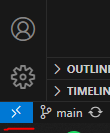
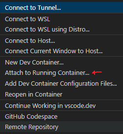
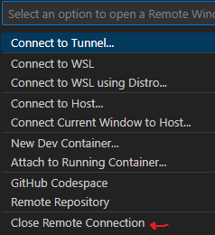

Deploy FastAPI Application via Docker
=====================================

Following [FastAPI docs](https://fastapi.tiangolo.com/deployment/docker/)

Following [How to create a great dev environment with Docker](https://youtu.be/0H2miBK_gAk?si=lllFonixFqUq58Eq) by Patrick Loeber.

In it's current state, you run the app via `docker-compose` as detailed below.

# Docker Image and Container

Build the image

```bash
docker build -t fastapi-app-with-docker .
```

Run Docker container using

```bash
. /start_container.sh
```

View docs at [http://localhost/docs](http://localhost/docs)

To check if a container was made, run

`docker inspect <container tag>`

# Docker Dev Environment

Open the remote VSCode window (bottom right)



Select to attach to running container



Install the `Python` VSCode extension. This will be installed in this container so as long as this container persists you won't have to reinstall this extension again. This extension will allow VSCode to find variable definitions (can use `F12`). If this does not work right away, close and re-connect VSCode.

To close this instance, click the blue button in the bottom-right and select to close remote connection



Additionally, you may get some warnings regarding the `Python` extension, these should be resolved with restarting.

Changes in this containarized instance of VSCode will be reflected in the host machine.

Some [info](https://github.com/patrickloeber/python-docker-tutorial/tree/main/dev-environment#7-debug-python-code-inside-a-container) on debugging

# docker-compose

Seems like using docker-compose results in a ~20s delay between making changes to the code and `uvicorn` picking them up and reflecting these changes in the live API.

Kick things off with

```bash
docker-compose up
```

Use the `--build` option to rebuild the image. Use `-d` option for detached mode.

Can stop the container with `Ctrl+C`, then to get rid of the container stack, use

```bash
docker-compose down
```
